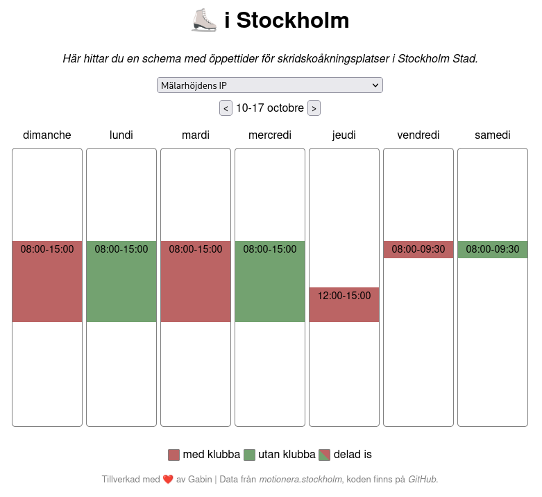

# Skridskoåkning i Stockholmstad
This repository contains code to retrieve schedule for ice skating areas in Stockholm City.
The data is parsed and converted to machine readable format, in order to be presented as a simple website.

## Requirements
- python (>3.9)
- lxml
- requests

## Installation

1. Set your web server's root to the `dist/` directory.
2. Retrieve and parse the schedule: `update_data.py -d dist/data/`.
3. (optionnal) Configure a cron job to update data once in a while.

## Usage
The `update_data.py` script retrieves and parses information from Stockholm City website, it creates one JSON file per week (_e.g._ `2022-10-10.json` will contain schedules for the week starting on _Monday 2022-10-10_).

For more information, use `python update_data.py --help`.

The root of the web server should point to the `dist` folder. It contains the files to be served to the client. The `dist/data` directory contains the parsed schedule information files.